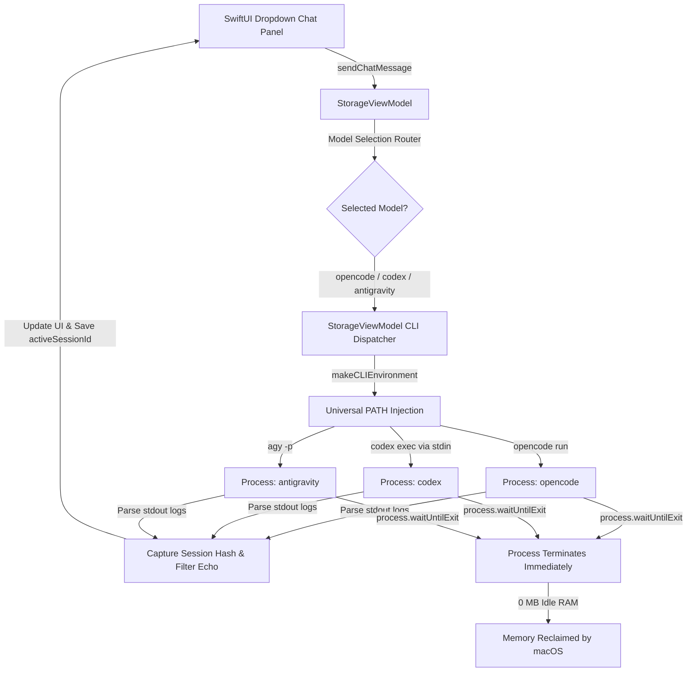
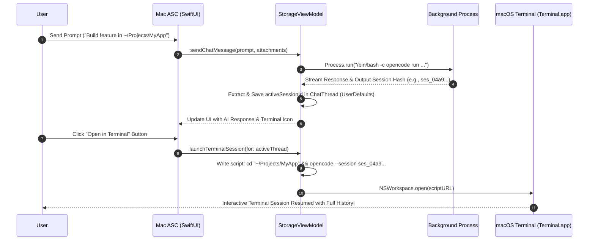

# AI & Multi-Agent Integration Architecture - Mac ASC

This document explains the technical design, execution pipelines, memory management, and subprocess architecture for external **CLI Agents (`opencode`, `codex`, `antigravity`)** integrated into **Mac ASC**.

---

## 🌟 Overview & Architecture

**Mac ASC** features a unified multi-agent AI assistant system supporting:
- **System CLI AI Agents (`opencode`, OpenAI `codex`, Google `antigravity` / `agy`)**: Direct integration with local CLI tools installed on your Mac, supporting dynamic model discovery, provider model preservation, session hash tracking, and interactive Terminal handoff.

### Key Highlights
- **Universal CLI Agent Discovery**: Resolves `opencode`, `codex`, and `antigravity` (`agy`) across Apple Silicon (`/opt/homebrew`), Intel (`/usr/local`), NPM, NVM, Cargo, and Bun paths.
- **Zero Idle Memory Footprint**: Spawns processes strictly on-demand. Consumes **0 MB RAM** and **0% CPU** when idle.
- **Interactive Terminal Handoff**: Resumes active chat sessions directly inside macOS Terminal with proper workspace `cd` navigation and session hash binding.

---

## 🏗️ Unified AI Execution Pipeline



---

## 🚀 Terminal Handoff & Session Persistence Sequence Diagram

When you click **"Resume Session in Terminal"**, Mac ASC generates an executable script (`.command`) that navigates to your workspace and resumes the active session hash:



---

## 🔑 Session Hash Extraction & CLI Command Mapping

1. **`opencode`**:
   - **Session Hash**: `ses_[a-zA-Z0-9]+`
   - **In-App Runner**: `opencode run "<prompt>" -m <model> --auto`
   - **Terminal Resume**: `cd "<attached_path>" && opencode --session <sessionId> -m <model> --auto`
   - **Session Cleanup**: `opencode session delete <sessionId>`

2. **OpenAI `codex`**:
   - **Session Hash**: `--conversation=<uuid>`
   - **In-App Runner**: `echo "<prompt>" | codex exec -m <model> --skip-git-repo-check`
   - **Terminal Resume**: `cd "<attached_path>" && codex resume <sessionId>`

3. **Google `antigravity` (`agy`)**:
   - **Session Hash**: `--conversation=<uuid>`
   - **In-App Runner**: `agy -p "<prompt>" --model <model> --add-dir "<path>"`
   - **Terminal Resume**: `cd "<attached_path>" && agy --conversation=<sessionId> --model <model>`

---

## 📊 Google Antigravity Quota Tracking Architecture

To provide accurate model capacity tracking without background resource overhead, Mac ASC interfaces directly with the Antigravity CLI's usage command:

```mermaid
graph TD
    Trigger[User clicks ↻ or Refreshes Disk Insight] --> VM[StorageViewModel.fetchAgyUsage]
    VM --> CLI[Run: agy --output-format json -p /usage]
    CLI --> JSON[Raw JSON Output]
    
    JSON --> Dec[JSONDecoder: AgyUsageJSONResponse]
    Dec --> Buckets[command.data.groups[].buckets[]]
    
    Buckets --> ExactDec[Extract remaining_fraction -> String(format: '%.2f%%')]
    Buckets --> TimeParse[Parse resets_at ISO-8601 -> Relative Countdown 'in Xh Ym']
    
    ExactDec --> State[agyUsageGroups & agyUsageQuotas Published State]
    TimeParse --> State
    
    State --> View1[Disk Insight: Antigravity Quota Section]
    State --> View2[AI Chat: Gauge Popover View]
    View1 --> Rings[CircularQuotaRing: Arc Canvas & Symmetrical Pills]
    View2 --> Rings
```

### 1. High-Precision JSON Extraction
Standard text output truncates remaining quota to integer values (e.g. `99%`). By passing `--output-format json`, Mac ASC accesses full floating-point values from `remaining_fraction` (e.g., `0.9983311891555786` $\to$ `99.83%`), ensuring complete precision.

### 2. Relative Countdown Parsing
Reset timestamps in ISO-8601 format (`YYYY-MM-DDTHH:mm:ssZ`) are parsed against current local time to compute human-friendly relative countdowns (`Refreshes in 78h 5m` or `Refreshes in 3h 54m`). If remaining quota is 100% or reset time has passed, it cleanly states `Quota available`.

### 3. Symmetrical UI Alignment
To avoid horizontal clipping on narrow popovers (320–340px width), standard progress bars are replaced with compact `CircularQuotaRing` components. Quota pills utilize `maxWidth: .infinity` inside balanced `HStack` rows, ensuring perfect vertical alignment between **Gemini** and **Claude + GPT** limit rows.

### 4. Zero Background Overhead Guarantee
The quota fetcher does **not** employ background timers, daemons, or polling loops. Execution occurs strictly on-demand:
- When the user presses the dedicated `↻` button beside the section header.
- When performing a full Disk Insight refresh.
- During initial application initialization (if `agy` binary is discovered).
Between queries, the subprocess exits immediately and consumes **0.0% CPU** and **0 MB RAM**.
