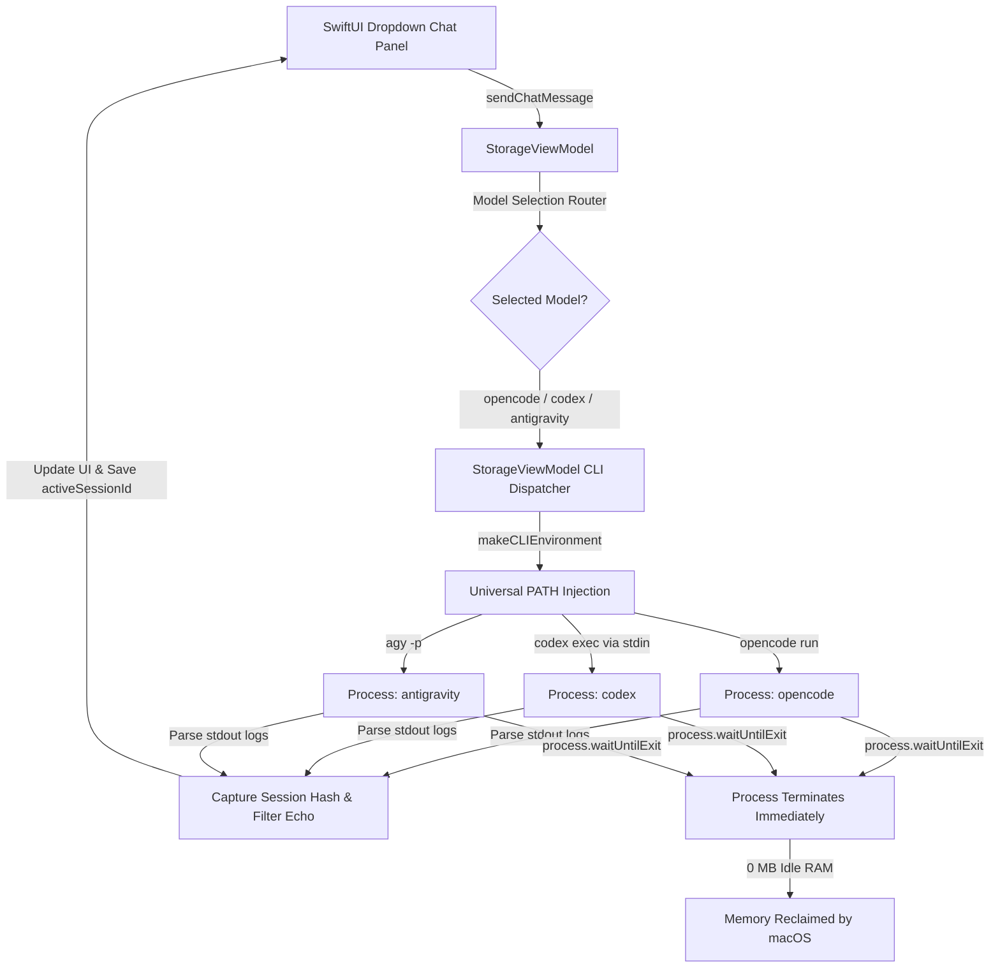

# AI & Multi-Agent Integration Architecture - Mac ASC

This document explains the technical design, execution pipelines, memory management, and subprocess architecture for external **CLI Agents (`opencode`, `codex`, `antigravity`)** integrated into **Mac ASC**.

---

## 🌟 Overview & Architecture

**Mac ASC** features a unified multi-agent AI assistant system supporting:
- **System CLI AI Agents (`opencode`, OpenAI `codex`, Google `antigravity` / `agy`)**: Direct integration with local CLI tools installed on your Mac, supporting dynamic model discovery, provider model preservation, session hash tracking, and interactive Terminal handoff.

### Key Highlights
- **Universal CLI Agent Discovery**: Resolves `opencode`, `codex`, and `antigravity` (`agy`) across Apple Silicon (`/opt/homebrew`), Intel (`/usr/local`), NPM, NVM, Cargo, and Bun paths.
- **Zero Idle Memory Footprint**: Spawns processes strictly on-demand. Consumes **0 MB RAM** and **0% CPU** when idle.
- **Interactive Terminal Handoff**: Resumes active chat sessions directly inside macOS Terminal with proper workspace `cd` navigation and session hash binding.

---

## 🏗️ Unified AI Execution Pipeline

---

## 🚀 Terminal Handoff & Session Persistence

When you click **"Resume Session in Terminal"**, Mac ASC generates a executable script (`.command`) that:
1. Navigates to your workspace or home directory (`~`).
2. Invokes the native CLI binary (`opencode`, `codex`, `antigravity`) with `--session <sessionId>` or `--conversation=<id>`.
3. Opens a native interactive terminal window where you can continue full multi-file coding workflows seamlessly.
