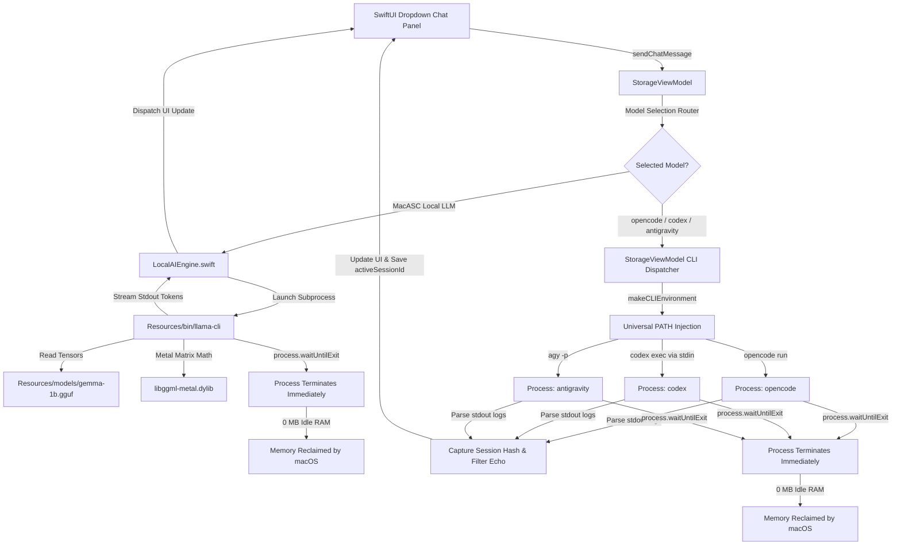
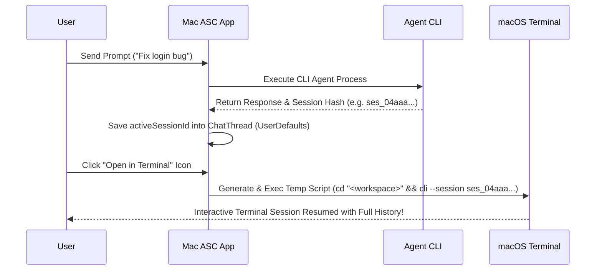

# AI & Multi-Agent LLM Integration Architecture - Mac ASC

This document explains the technical design, execution pipelines, memory management, and subprocess architecture for both the embedded 100% offline **Local LLM Engine** and external **CLI Agents (`opencode`, `codex`, `antigravity`)** integrated into **Mac ASC**.

---

## 🌟 Overview & Dual Execution Architecture

**Mac ASC** features a unified multi-agent AI assistant system supporting:
1. **MacASC Local LLM (Google Gemma 3 1B Instruct)**: 100% offline, air-gapped, Apple Metal GPU-accelerated GGUF neural engine (`gemma-1b.gguf`).
2. **System CLI AI Agents (`opencode`, OpenAI `codex`, Google `antigravity` / `agy`)**: Integration with local CLI tools installed on your Mac, supporting dynamic model discovery, provider model preservation, session hash tracking, and Terminal handoff.

### Key Highlights
- **100% Offline Local Option**: Embedded `Gemma 3 1B` requires zero internet, zero API keys, and zero external CLI dependencies.
- **Universal CLI Agent Discovery**: Resolves `opencode`, `codex`, and `antigravity` (`agy`) across Apple Silicon (`/opt/homebrew`), Intel (`/usr/local`), NPM, NVM, Cargo, and Bun paths.
- **Zero Idle Memory Footprint**: Spawns processes on-demand. Consumes **0 MB RAM** and **0% CPU** when idle.
- **Interactive Terminal Handoff**: Resumes active chat sessions directly inside macOS Terminal with proper workspace `cd` navigation and session hash binding.

---

## 🏗️ Unified AI Execution Pipeline



---

## 📦 Bundled Components & Local Assets

| Component | Path | Description | Size |
| :--- | :--- | :--- | :--- |
| **Model Weights** | `Resources/models/gemma-1b.gguf` | Official Gemma 3 1B Instruct GGUF (`Q8_0` quantization) | 1.1 GB |
| **Inference Executable** | `Resources/bin/llama-cli` | Compiled C++ GGUF inference binary linked with `@executable_path` | ~50 KB |
| **Backend Libraries** | `Resources/bin/*.dylib` | Apple Metal & CPU GGML backend dynamic libraries | ~17 MB |
| **Local AI Manager** | `Sources/LocalAIEngine.swift` | Swift manager for local process execution, streaming, & prompt formatting | 282 lines |
| **ViewModel & CLI Coordinator** | `Sources/StorageViewModel.swift` | Dispatches prompts, parses session hashes, resolves PATHs, and manages threads | 2,426 lines |

---

## ⚙️ How CLI Agent Execution Works

### 1. Universal PATH & Binary Discovery
- **Binary Resolution (`findBinaryPath`)**:
  Mac ASC checks standard installation locations (`/opt/homebrew/bin`, `/usr/local/bin`, `~/.npm-global/bin`, `~/.nvm`, `~/.bun/bin`, `~/.cargo/bin`, `~/.local/bin`, `~/.gemini/bin`) and falls back to dynamic interactive shell query `zsh -l -c "which <binary>"`.
- **Environment Injection (`makeCLIEnvironment`)**:
  Builds a complete PATH environment so CLI tools relying on Node (`codex`) or Python run seamlessly without `env: node: No such file or directory` errors.

### 2. Provider Model Preservation
- Model names selected in the UI dropdown preserve full provider prefix identifiers (e.g. `opencode/deepseek-v4-flash-free`).
- When launching `opencode`, `-m opencode/deepseek-v4-flash-free` is passed directly, preventing provider API resolution errors.

### 3. Role-Aware Output Cleaning (`cleanOpencodeOutput`)
- Filters stdout stream in a single pass ($O(N)$):
  - Strips ESC-prefixed ANSI sequences and raw bracket escape bytes.
  - Skips echoed user prompt lines, banner blocks, and CLI headers.
  - Stops parsing at `tokens used` delimiters to prevent duplicate response text.

### 4. Session Hash Persistence & Terminal Resume



- **Session Extraction**: Parses `stdout` regex for `ses_[a-zA-Z0-9]+` (`opencode`/`codex`) or `--conversation=<uuid>` (`antigravity`).
- **Terminal Resume**: Clicking **Open in Terminal** generates an executable shell script that:
  1. Changes working directory (`cd "<attached_path>"`) to the first attached project folder.
  2. Launches interactive CLI session resuming the exact session hash.

### 5. Automatic Remote Session Cleanup
- When a thread is deleted or cleared, `deleteRemoteSession` fires a background process running `opencode session delete <sessionID>`, removing stale sessions from server memory.

---

## ⚡ Memory Management (0 MB Idle Footprint)

1. **Subprocess Lifetime**: Both Local LLM (`llama-cli`) and CLI agents (`opencode`, `codex`, `agy`) are executed as short-lived background subprocesses (`Process()`).
2. **On-Demand Execution**: No background daemon or web server remains running when chat is idle.
3. **Immediate Memory Reclamation**: Upon completing generation, `process.waitUntilExit()` finishes, `activeAiProcess` is set to `nil`, and macOS immediately reclaims 100% of memory. Idle RAM overhead is **0 MB**.

---

## 💻 Terminal CLI Execution Examples

### 1. Embedded Local LLM Execution
```bash
# Interactive Chat Mode with Gemma 1B
./Resources/bin/llama-cli -m Resources/models/gemma-1b.gguf -ngl 99 --temp 0.6

# Single Prompt Execution
./Resources/bin/llama-cli -m Resources/models/gemma-1b.gguf \
  -p "<start_of_turn>user\nExplain disk swap space in two sentences.<end_of_turn>\n<start_of_turn>model\n" \
  -n 128 --temp 0.6 -st --simple-io --no-display-prompt -ngl 99 -r "<end_of_turn>"
```

### 2. CLI Agent Resumption Examples
```bash
# Resume Opencode Session in Project Workspace
cd "/Users/hello/Desktop/Projects/My App"
/opt/homebrew/bin/opencode --session ses_04aaa1019ffeTbh0ZseUsNzirM -m opencode/deepseek-v4-flash-free

# Resume Codex Session
cd "/Users/hello/Desktop/Projects/My App"
/opt/homebrew/bin/codex resume ses_04aaa1019ffeTbh0ZseUsNzirM

# Resume Antigravity Session
cd "/Users/hello/Desktop/Projects/My App"
/opt/homebrew/bin/agy --conversation=097bf34d-407a-47b3-9327-e8844fcbf7fa --model gemini-3.6-flash-medium
```
