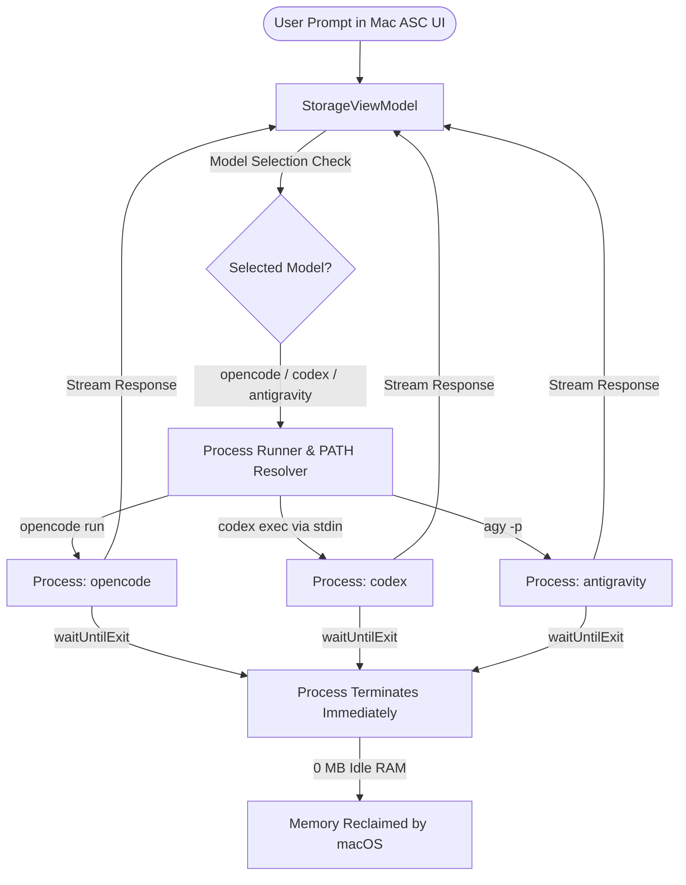
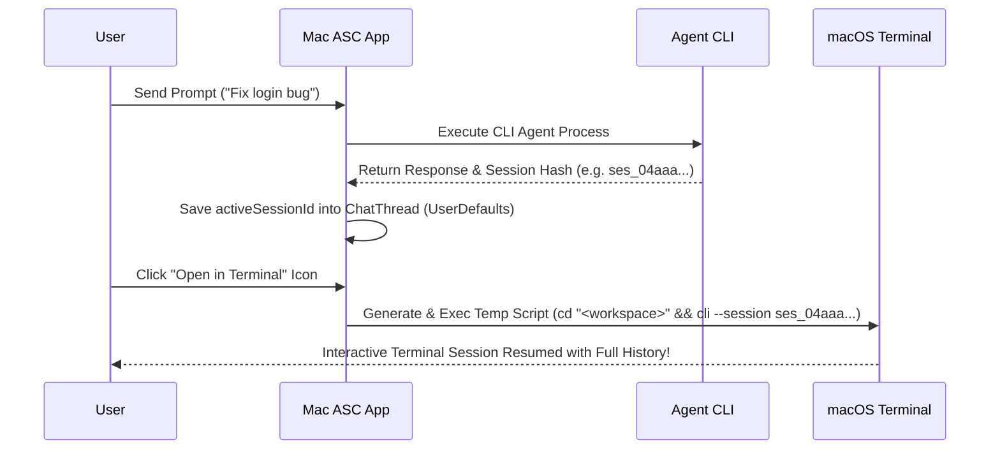

# Mac ASC

Mac ASC is a premium, lightweight, and privacy-focused macOS menu bar utility built with SwiftUI and AppKit. It provides a real-time, categorized breakdown of your internal and external storage space, interactive application monitoring, quick folder pinning with direct Finder navigation, custom shell script shortcuts, quick note-taking, and a native multi-agent AI assistant panel supporting **CLI Agents (`opencode`, OpenAI `codex`, Google `antigravity` / `agy`)**.

Designed with a sleek, translucent glassmorphism interface, it blends seamlessly with the macOS environment while ensuring total data privacy and zero background RAM leakage.

### 📥 [Download Latest Release DMG (v1.1.0)](https://github.com/Rian445/MacAsc/releases/download/v1.1.0/Mac_ASC.dmg)

---

## 📸 Interface Previews

<p align="center">
  
</p>

---

## ✨ Key Features

* **🪟 Premium Glassmorphic UI**: Uses AppKit's native backdrop-blur transparency (`NSVisualEffectView` layered with a 45% dark opacity tint) to create a wallpaper-bleeding menu bar dropdown that respects light and dark modes dynamically.
* **🤖 Multi-Agent AI Assistant Panel**:
  * **Multi-CLI Agent Compatibility (`opencode` + `codex` + `antigravity`)**: Fully compatible with your system-installed AI CLI tools:
    * ⚡ **`opencode` CLI**: Execute models from `opencode` (e.g. `opencode/deepseek-v4-flash-free`, `opencode/big-pickle`). Includes automatic session discovery and remote session cleanup on thread deletion.
    * 🤖 **OpenAI `codex` CLI**: Seamlessly run Codex models (`gpt-5.5`, `gpt-4o`) via `stdin` prompt piping with auto-directory context.
    * 🌌 **Google `antigravity` (`agy`) CLI**: Execute Google Antigravity models (`gemini-3.6-flash-medium`, `gemini-3.5-flash-low`) with multi-path context flag mapping (`--add-dir`).
  * **Provider Model Preservation**: Preserves full provider model identifiers (e.g. `opencode/deepseek-v4-flash-free`) to ensure zero API endpoint resolution errors.
  * **Interactive Terminal Launcher**: Launch active chat sessions directly into macOS Terminal (`cd "<attached_path>"`) with single and multi-path file/folder attachment support.
  * **Automatic Server Session Cleanup**: Deletes server-side sessions on `opencode` automatically when a thread is deleted or cleared.
  * **Zero Idle Memory Footprint**: Spawns processes strictly on-demand and terminates immediately upon response completion (`0 MB RAM` when idle).
  * **File & Folder Context Attachment**: Drag and drop any file or folder anywhere onto the chat window, or click the **Paperclip** icon to attach local path context for the AI.
  * **Markdown & Code Snippets**: Render multi-line markdown formatting, bullet points, headers, and syntax blocks.
* **📁 Nested Subfolders & Tree Hierarchy**: Supports unlimited nested folder trees using forward-slash path strings (e.g. `DevOps/Docker` or `Work/Projects/Scripts`) across Custom Commands and Quick Notes. Subfolders render with visual tree indentation, recursive collapse/expand, and item count badges.
* **🔃 Interactive Sort Mode & Drag-and-Drop Nesting**: Click the **Sort** button at the top of Saved Commands or Saved Notes to activate manual sorting mode:
  * **Up / Down Arrow Controls**: Manually reorder folders, subfolders, and individual items up and down.
  * **Drag-and-Drop Folder Nesting**: Drag any folder and drop it onto another folder to nest it inside (`Target Folder / Dragged Folder`).
  * **Move Out / Un-nest (`[↰]`)**: Click the Move Out button on any nested subfolder to un-nest it out of its parent folder.
* **↔️ Expand / Collapse All**: Easily expand or collapse all folder structures across all nesting levels in a single click.
* **🗑️ Safe Folder Deletion**: Delete folders directly using the minus button with a safety confirmation dialog giving you the choice to **Uncategorize Items** (keep commands/notes) or **Delete Folder & All Contents**.
* **📊 Categorized Storage Breakdown**: Visualizes your storage allocations using multi-colored stacked progress bars:
  * 🔵 **Applications**
  * 🟣 **Developer Files** (build directories, caches)
  * 🟠 **Documents**
  * 🟢 **Media Files** (audio, video, photos)
  * ⚪ **System / Other**
* **🔌 Multi-Drive Support**: Automatically detects and monitors external USB drives, SD cards, and Thunderbolt disks. Scan categorized breakdowns and safely eject external volumes directly from the dropdown.
* **📌 Folder Pinning & Size Tracker**: Select and pin custom directories to the dashboard. The application calculates directory sizes asynchronously in the background and provides single-click Finder access.
* **📱 Interactive App List**: Automatically lists your top installed applications by size. Click "Other Apps" to expand and view the full list, or tap on any application to instantly locate it in Finder.
* **⚙️ Main Window Settings & Tab Reordering**: A Settings icon button in the header opens preferences directly in the main window:
  * **About Page**: Lists developer details, ATS security specifications, and exact disk usage/preference sizes for the application.
  * **Dashboard Tweaks & Tab Reordering**: Toggle switches to show or hide dashboard components (*Disk Insight*, *Custom Commands*, *Quick Note*, *Chat with AI*) and manually reorder dashboard tabs using Up/Down controls.
  * **Comprehensive Backup & Restore**: Export all custom commands, quick notes, nested subfolder structures, tab sorting order, folder sort orders, pinned folders, tweaks, and AI chat sessions into a JSON backup file, or upload/import a backup file to restore your configuration instantly.
* **💾 Local Storage Cache**: Caches scanned storage categories locally for instant load times on launch.
* **🔒 100% Safe & Private**: Contains zero analytics, zero telemetry, and zero tracking code.

---

## 🏗️ AI Architecture & Memory Management

Mac ASC uses an **On-Demand Subprocess Execution Model**. Unlike traditional AI desktop apps that run background daemons or heavy Chromium/Electron processes in memory, Mac ASC maintains a **0 MB idle RAM footprint** for AI execution.

### 📊 Visual Execution Pipeline



### ⚡ How Memory is Managed:
1. **Prompt Trigger**: When a user submits a prompt, `StorageViewModel` spawns a background `Process()`.
2. **Token Generation**: 

   - **CLI Agents**: Executes `opencode`, `codex`, or `antigravity` via universal PATH resolution (`makeCLIEnvironment()`).
3. **Instant Process Termination**: As soon as token generation completes, `process.waitUntilExit()` finishes, `activeAiProcess` is set to `nil`, and macOS reclaims 100% of the process memory.
4. **Idle State**: Between chat queries, **no AI daemon runs in memory**. Added RAM footprint is **0 MB**.

---

## 🔄 Session Hash Persistence & Interactive Terminal Resume

Mac ASC automatically captures and remembers CLI session hashes so you can seamlessly transition between in-app chat and interactive Terminal sessions:



### 🔑 How Session Hashing Works:
1. **Hash Extraction**: On the first prompt in a thread, `StorageViewModel` parses `stdout` logs using regex to capture the CLI agent's unique session hash (`ses_[a-zA-Z0-9]+` for `opencode`/`codex` or `--conversation=<uuid>` for `antigravity`).
2. **Thread Persistence**: The session hash is saved into `ChatThread.activeSessionId` inside macOS `UserDefaults`.
3. **In-App Continuity**: All subsequent prompts in that thread append `--session <sessionId>` or `--conversation=<sessionId>`, maintaining full conversation context.
4. **Terminal Handoff**: Clicking the **Terminal icon** generates a executable script that changes directory into your attached project workspace (`cd "<attached_path>"`) and executes the interactive CLI resume command:
   - **`opencode`**: `cd "<attached_path>" && opencode --session <sessionId> -m <model>`
   - **`codex`**: `cd "<attached_path>" && codex resume <sessionId>`
   - **`antigravity`**: `cd "<attached_path>" && agy --conversation=<sessionId> --model <model>`

---

## 🛠️ Technology Stack

* **Platform**: macOS 13.0+
* **Language**: Swift 5.9+ (Swift 6 async-concurrency compliant)
* **Frameworks**: SwiftUI & AppKit (MVVM Architecture)
* **Subprocesses**: Native background process wrapper (`Process` & `Pipe`) executing system CLI agents (`opencode`, OpenAI `codex`, Google `antigravity` / `agy`).
* **Packaging**: Built into a standalone `.app` bundle and distributed via a compressed `.dmg` installer.

---

## 🚀 Building & Running

A shell script `build.sh` is included to compile the Swift source files, generate app metadata, structure the bundle, and package the installer.

### Prerequisite
* macOS 13+ with Xcode Command Line Tools installed (run `xcode-select --install` if you don't have it).

### Installation

#### Option 1: Homebrew Cask (Recommended)
You can tap this repository and install the application directly via Homebrew.

```bash
# 1. Tap the repository directly
brew tap Rian445/MacAsc https://github.com/Rian445/MacAsc.git

# 2. Trust the tap (Required for third-party user taps on newer Homebrew versions)
brew trust rian445/macasc

# 3. Install the application
brew install --cask macasc
```

#### Option 2: Direct Download DMG
1. Download the pre-compiled **[Mac_ASC.dmg](https://github.com/Rian445/MacAsc/releases/download/v1.1.0/Mac_ASC.dmg)**.
2. Double-click the downloaded `.dmg` file to mount it.
3. Drag **Mac ASC** into your **Applications** folder.

#### Option 3: Build from Source
1. **Clone the Repository**:
   ```bash
   git clone https://github.com/Rian445/MacAsc.git
   cd MacAsc
   ```

2. **Build and Package**:
   Run the build script in the root directory:
   ```bash
   chmod +x build.sh
   ./build.sh
   ```
   *This script compiles the binary, structures the `Mac ASC.app` bundle, generates standard macOS icon sets, and compiles everything into a DMG installer named `Mac_ASC.dmg`.*

---

## 📁 File Structure

* `Sources/`
  * `MacStorageUtilityApp.swift` — App entry point deploying the Status Bar Item and centered `NSPanel` controller.
  * `StorageViewModel.swift` — Coordinates application state, custom commands, quick notes, AI chat threads, `opencode`/`codex`/`antigravity` CLI discovery, and directory size indexing.
  * `StorageManager.swift` — Scans application sizes, traverses folder hierarchies asynchronously, and measures disk volumes.
  * `DropdownView.swift` — Core user interface, modular `@ViewBuilder` chat controls, sliding tab switcher, custom commands pane, quick notes, and multi-agent AI chat panel overlays.
  * `VisualEffectView.swift` — Bridges SwiftUI to AppKit for custom glassmorphism.
* `app_icon.png` — High-resolution source icon.
* `build.sh` — Compilation script compiling code and packing the DMG.

---

## 📄 License, Changelog & Privacy

* **Changelog**: Read [CHANGELOG.md](CHANGELOG.md) for version release notes.
* **Privacy Policy**: Read [PRIVACY.md](PRIVACY.md) for full data privacy details.
* **Architecture Docs**: Read [AI_ARCHITECTURE.md](AI_ARCHITECTURE.md) for technical multi-agent inference details.
* **License**: Open-source under the [MIT License](LICENSE).
