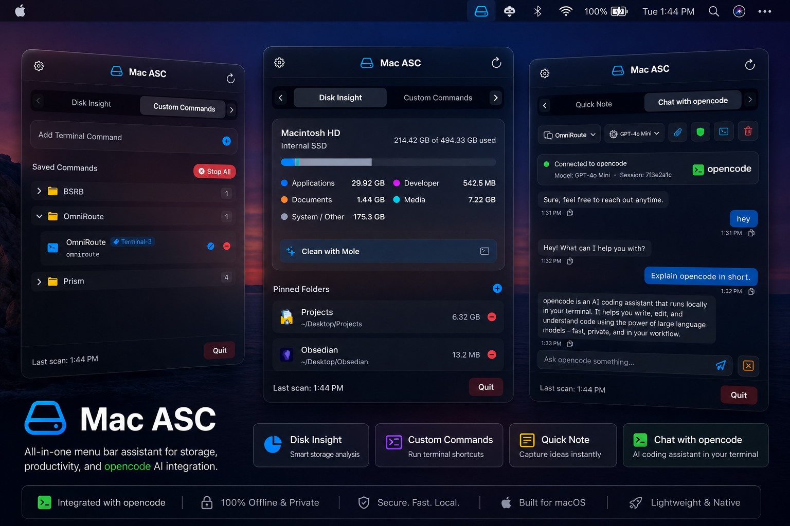

# Mac ASC

Mac ASC is a premium, lightweight, and 100% offline-locked macOS menu bar utility built with SwiftUI and AppKit. It provides a real-time, categorized breakdown of your internal and external storage space, interactive application monitoring, quick folder pinning with direct Finder navigation, custom shell script commands, quick note-taking, and a native offline Local AI assistant panel.

Designed with a sleek, translucent glassmorphism interface, it blends seamlessly with the macOS environment while ensuring absolute data privacy.

### 📥 [Download Latest Release DMG](https://github.com/Rian445/MacAsc/releases/download/APP/Mac_ASC.dmg)

---

## 📸 Interface Previews

<p align="center">
  
</p>

---

## ✨ Key Features

* **🪟 Premium Glassmorphic UI**: Uses AppKit's native backdrop-blur transparency (`NSVisualEffectView` layered with a 45% dark opacity tint) to create a stunning, wallpaper-bleeding menu bar dropdown that respects light and dark modes dynamically.
* **↔️ Tab Paging Slider**: Rebuilds the segmented header into a horizontal sliding window that displays two tabs at a time with direction-aware spring animations and infinite circular wrapping (`<` and `>`):
  * **Page 0**: *Disk Insight* & *Custom Commands*
  * **Page 1**: *Quick Note* & *Chat with AI*
* **🧠 Native Offline Local LLM (Google Gemma 3 1B Instruct)**: A dedicated 100% offline AI Chat panel powered by an embedded Apple Metal GPU-accelerated GGUF neural inference engine:
  * **100% Plug-and-Play Offline**: Runs directly on your Mac's Metal GPU at high speeds without internet access or external CLI dependencies (`opencode`, `ollama`, or `python` NOT required).
  * **Instruction-Tuned Model**: Uses the official `gemma-3-1b-it-Q8_0.gguf` model (`gemma-1b.gguf`) for smart assistant responses, code generation, and Q&A.
  * **Zero Idle Memory Footprint**: Spawns processes on-demand and terminates immediately upon output completion (`0 MB RAM` when idle).
  * **Multiple Chat Threads**: Create, name, switch, and delete multiple independent conversation threads.
  * **Auto-Naming Threads**: New chat threads automatically rename themselves to match your first query.
  * **File & Folder Context (Hidden Injection)**: Drag and drop any file or folder anywhere onto the chat window, or click the **Paperclip** icon button in the header to attach local paths. The app silently injects the path metadata (`Attached Context Directory: <path>`) into your query, allowing the Local AI to inspect files or folder contexts.
  * **Visual State Handoff**: The paperclip icon lights up in yellow (`paperclip.circle.fill`) when a file or directory is attached.
  * **Interactive Bubble Controls**: Message bubbles support text selection and instant copy-to-clipboard actions with checkmark feedback.
  * **Stop AI Processing**: Cancel running queries mid-way, immediately terminating the background process and releasing ports/RAM.
  * **Preserved Formatting**: Fully supports multi-line markdown rendering, bullet points, headers, and code snippets without collapsing lines.
* **📁 Nested Subfolders & Tree Hierarchy**: Supports unlimited nested folder trees using forward-slash path strings (e.g. `DevOps/Docker` or `Work/Projects/Scripts`) across Custom Commands and Quick Notes. Subfolders render with visual tree indentation, recursive collapse/expand, and item count badges.
* **🔃 Interactive Sort Mode & Drag-and-Drop Nesting**: Click the **Sort** button at the top of Saved Commands or Saved Notes to activate manual sorting mode:
  * **Up / Down Arrow Controls**: Manually reorder folders, subfolders, and individual items up and down.
  * **Drag-and-Drop Folder Nesting**: Drag any folder and drop it onto another folder to nest it inside (`Target Folder / Dragged Folder`).
  * **Move Out / Un-nest (`[↰]`)**: Click the Move Out button on any nested subfolder to un-nest it out of its parent folder.
  * **Strict Safety**: Drag-and-drop gesture interaction is strictly locked when Sort mode is off, preventing accidental folder moves during daily clicking.
* **↔️ Expand / Collapse All**: A dedicated button beside the Sort button allows expanding or collapsing all folders across all nesting levels in a single click.
* **🗑️ Safe Folder Deletion**: Delete folders directly using the minus button with a safety confirmation dialog giving you the choice to **Uncategorize Items** (keep commands/notes) or **Delete Folder & All Contents**.
* **📊 Categorized Storage Breakdown**: Visualizes your storage allocations using multi-colored stacked progress bars. Breaks down space into:
  * 🔵 **Applications**
  * 🟣 **Developer Files** (build directories, caches)
  * 🟠 **Documents**
  * 🟢 **Media Files** (audio, video, photos)
  * ⚪ **System / Other**
* **🔌 Multi-Drive Support**: Automatically detects and monitors external USB drives, SD cards, and thunderbolt disks. Scan categorized breakdowns and safely eject external volumes directly from the dropdown.
* **📌 Folder Pinning & Size Tracker**: Select and pin custom directories to the dashboard. The application calculates directory sizes asynchronously in the background and provides single-click Finder access.
* **📱 Interactive App List**: Automatically lists your top installed applications by size. Click "Other Apps" to expand and view the full list, or tap on any application to instantly locate it in Finder.
* **⚙️ Main Window Settings & Tab Reordering**: A Settings icon button in the header opens preferences directly in the main window:
  * **About Page**: Lists developed details, ATS security specifications, and exact disk usage/preference sizes for the application.
  * **Dashboard Tweaks & Tab Reordering**: Toggle switches to show or hide dashboard components (*Disk Insight*, *Custom Commands*, *Quick Note*, *Chat with AI*) and manually reorder dashboard tabs using Up/Down controls.
  * **Comprehensive Backup & Restore**: Export all custom commands, quick notes, nested subfolder structures, tab sorting order, folder sort orders, pinned folders, tweaks, and AI chat sessions into a JSON backup file, or upload/import a backup file to restore your configuration instantly.
* **💾 Local Storage Cache**: Caches scanned storage categories locally. On launch, it loads previous statistics instantly, ensuring a fast load time without display lag.
* **🔒 100% Offline & Secure**: Operates strictly offline. Has zero dependencies on network frameworks and is locked down via App Transport Security (ATS) to ensure your storage details never leave your device.

---

## 🛠️ Technology Stack

* **Platform**: macOS 13.0+
* **Language**: Swift 5.9+ (Swift 6 async-concurrency compliant)
* **Frameworks**: SwiftUI & AppKit (MVVM Architecture)
* **Subprocesses**: Native background process wrapper (`Process` & `Pipe`) executing bundled local binaries (`llama-cli`, `osascript`).
* **AI Engine**: Bundled C++/Metal GGUF inference engine (`llama-cli` & `libggml-metal.dylib`) with Google Gemma 3 1B Instruct model weights (`gemma-1b.gguf`).
* **Packaging**: Built into a standalone `.app` bundle and distributed via a compressed `.dmg` installer.

---

## 🚀 Building & Running

A shell script `build.sh` is included to compile the Swift source files, generate app metadata, structure the bundle, and package the installer.

### Prerequisite
* macOS 13+ with Xcode Command Line Tools installed (run `xcode-select --install` if you don't have it).

### Installation

#### Option 1: Direct Download (Recommended)
1. Download the pre-compiled **[Mac_ASC.dmg](https://github.com/Rian445/MacAsc/releases/download/APP/Mac_ASC.dmg)**.
2. Double-click the downloaded `.dmg` file to mount it.
3. Drag **Mac ASC** into your **Applications** folder.

#### Option 2: Homebrew Cask (Tap)
You can tap this repository and install the application directly via Homebrew.

```bash
# 1. Tap the repository directly
brew tap Rian445/MacAsc https://github.com/Rian445/MacAsc.git

# 2. Trust the tap (Required for third-party user taps on newer Homebrew versions)
brew trust rian445/macasc

# 3. Install the application
brew install --cask macasc
```

#### Option 3: Build from Source
1. **Clone the Repository**:
   ```bash
   git clone https://github.com/Rian445/MacAsc.git
   cd MacAsc
   ```
2. **Build and Package**:
   Run the build script in the root directory:
   ```bash
   ./build.sh
   ```
   *This script automatically checks for model weights, compiles the binary, structures the `Mac ASC.app` bundle, generates standard macOS icon sets, and compiles everything into a DMG installer named `Mac_ASC.dmg`.*
3. **Install & Launch**:
   * Open the generated `Mac_ASC.dmg` in Finder and drag **Mac ASC** into your **Applications** folder.

---

## 📁 File Structure

* `Sources/`
  * `MacStorageUtilityApp.swift` — App entry point deploying the Status Bar Item and centered `NSPanel` controller.
  * `StorageViewModel.swift` — Coordinates application state, custom commands, quick notes, AI chat threads, and directory size indexing.
  * `StorageManager.swift` — Scans application sizes, traverses folder hierarchies asynchronously, and measures disk volumes.
  * `LocalAIEngine.swift` — Swift manager executing native offline GGUF inference via Apple Metal GPU acceleration.
  * `DropdownView.swift` — The core user interface, sliding tab switcher, custom commands pane, quick notes, and local AI chat panel overlays.
  * `VisualEffectView.swift` — Bridges SwiftUI to AppKit for custom glassmorphism.
* `Resources/`
  * `bin/` — Bundled C++/Metal GPU inference binary (`llama-cli`) and backend dynamic libraries (`libggml-metal.dylib`, `libllama.dylib`).
  * `models/` — Bundled Gemma 3 1B Instruct GGUF model weights (`gemma-1b.gguf`).
* `app_icon.png` — High-resolution source icon.
* `build.sh` — Compilation script compiling code and packing the DMG.

---

## 📄 License & Privacy

* **Privacy Policy**: This application operates strictly offline and collects no data. See the [Privacy Policy](PRIVACY.md) for more details.
* **Architecture Docs**: Read [LOCAL_LLM_ARCHITECTURE.md](LOCAL_LLM_ARCHITECTURE.md) for full technical inference details.
* **License**: This project is open-source and available under the [MIT License](LICENSE).
