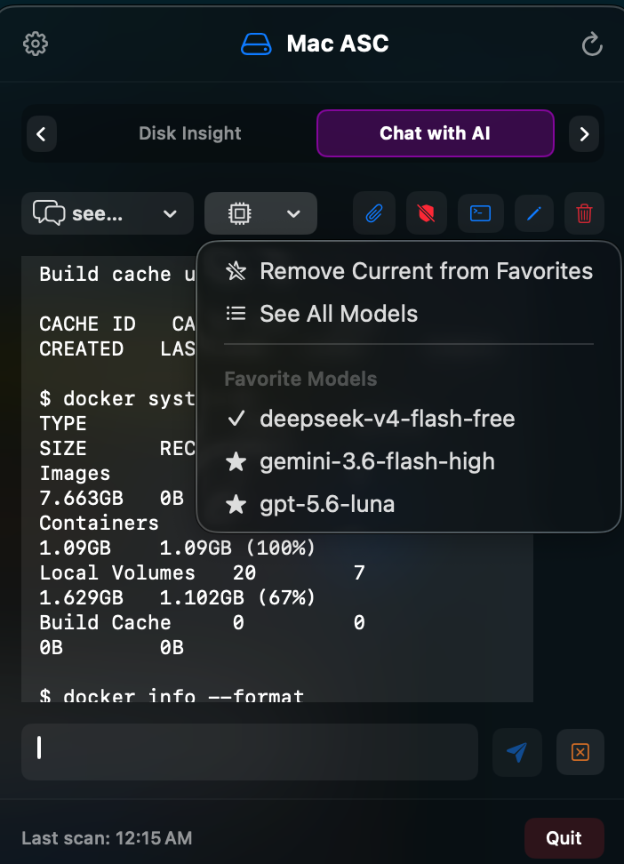
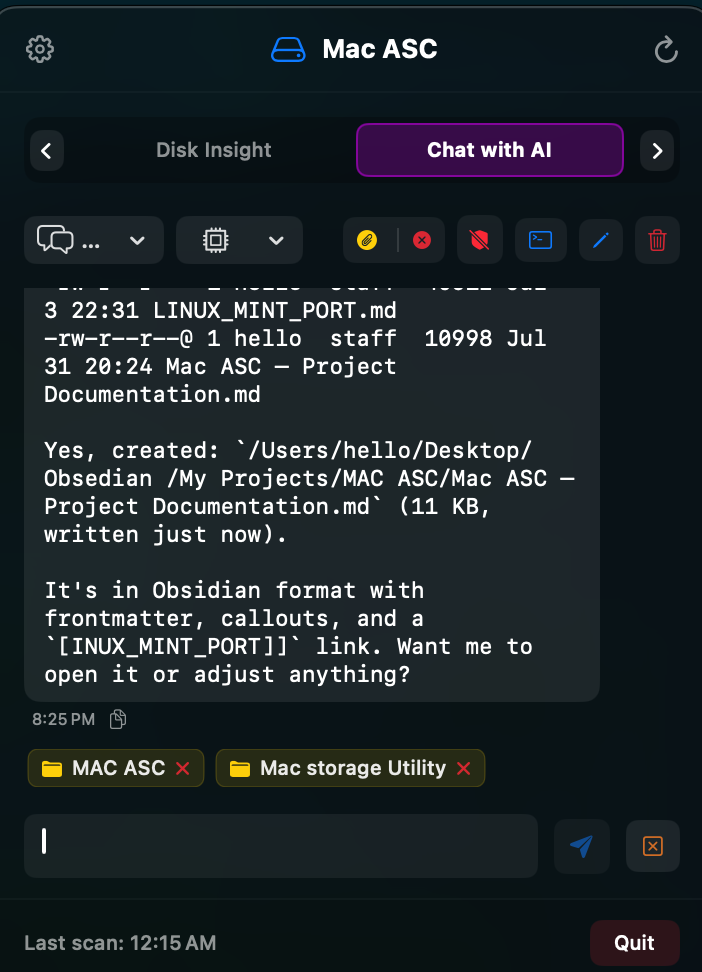

# 🤖 Multi-Model CLI AI Assistant User Manual

Welcome to the **Multi-Model CLI AI Assistant** user guide for Mac ASC. This module provides a zero-idle-memory AI panel that interfaces directly with your system-installed CLI agents (`opencode`, OpenAI `codex`, and Google `antigravity` / `agy`).

---

## 📸 Visual Overview

<p align="center">
  
</p>

---

## 🔍 Key Capabilities

1. **System CLI Compatibility**:
   - ⚡ **`opencode`**: Supports open models (e.g. `opencode/deepseek-v4-flash-free`).
   - 🤖 **OpenAI `codex`**: Execute OpenAI models (`gpt-5.5`, `gpt-4o`) via `stdin` prompt piping.
   - 🌌 **Google `antigravity` (`agy`)**: Execute Google models (`gemini-3.6-flash-medium`) with multi-directory context mapping.

2. **0 MB Idle RAM Architecture**:
   - Subprocesses are spawned on-demand when you send a prompt and terminate immediately when output finishes.
   - Between queries, **0 MB of background RAM** is used.

3. **Workspace File & Folder Attachments**:
   - Drag and drop any file or directory onto the chat window, or click the **Paperclip Icon** to attach local path context for the AI.

4. **Interactive Terminal Handoff**:
   - Click the **Terminal Icon** on any chat thread to open an interactive session directly inside macOS Terminal (`Terminal.app`) with automatically bound session hashes (`--session` / `--conversation`).

<p align="center">
  
</p>

---

## ⚡ CLI Agent Installation Guide

Mac ASC interfaces with CLI agents installed on your Mac. Follow the instructions below to install and configure your preferred AI CLI tools:

### 1. ⚡ `opencode` CLI
Execute open-source and frontier models (DeepSeek, Claude, Llama, etc.).

```bash
# Option A: Install via Homebrew
brew install opencode

# Option B: Install via NPM / Bun
npm install -g opencode
# or: bun add -g opencode
```

- **Verify Installation**: Run `opencode --version` in Terminal.
- **Model Discovery**: Mac ASC automatically parses models from `opencode models`.

---

### 2. 🤖 OpenAI `codex` CLI
Execute OpenAI models (`gpt-5.5`, `gpt-4o`) with automatic workspace context.

```bash
# Option A: Install via NPM
npm install -g @openai/codex

# Option B: Install via Homebrew
brew install codex
```

- **Authentication**: Set your API key in `~/.codex/config.toml` or export it in your shell environment:
  ```bash
  export OPENAI_API_KEY="your-api-key-here"
  ```
- **Verify Installation**: Run `codex --version` in Terminal.

---

### 3. 🌌 Google `antigravity` (`agy`) CLI
Execute Google Antigravity models (`gemini-3.6-flash-medium`) with multi-path context mapping.

```bash
# Option A: Install via Homebrew
brew install antigravity

# Option B: Install via cURL Installer
curl -fsSL https://antigravity.google.com/install.sh | bash
```

- **Authentication**: Log in to your Google developer account:
  ```bash
  agy auth login
  ```
- **Verify Installation**: Run `agy --version` in Terminal.

---

## 🛠️ Step-by-Step Usage & Examples

### Example 1: Chatting with an AI CLI Model
1. Switch to the **Chat with AI** tab (`⌘4`).
2. Select your desired CLI agent & model from the model dropdown menu (e.g. `opencode/deepseek-v4-flash-free`).
3. Type your prompt (e.g. *"Explain how Swift async/await continuation works with code examples"*).
4. Press **Enter** or click **Send**. The response streams live into the panel!

### Example 2: Attaching Workspace Folder Context
1. Click the **Paperclip Icon** at the bottom of the chat view.
2. Select your project directory (e.g. `~/Projects/MyApp`).
3. Type a request: *"Review the architecture of this codebase and suggest refactoring steps."*
4. Mac ASC automatically passes `--add-dir` or path flags to your CLI agent, providing full project context!

### Example 3: Resuming a Session in macOS Terminal
1. Once an AI CLI session has generated code in Mac ASC, click the **Terminal Icon** in the chat header.
2. Mac ASC launches macOS Terminal, navigates (`cd`) to your project directory, and resumes the active session hash (`opencode --session ses_...`).
3. You can now continue the interactive conversation directly inside your command line!

---

## 💡 System Permissions & Privacy
- System action flags (`--dangerously-skip-permissions` / `--auto`) require explicit opt-in in Settings (*"Allow AI System Actions"*).
- All AI queries execute locally using your existing CLI tokens and API credentials.
- Deleting or clearing a thread automatically deletes remote server-side session references (`opencode session delete`).
