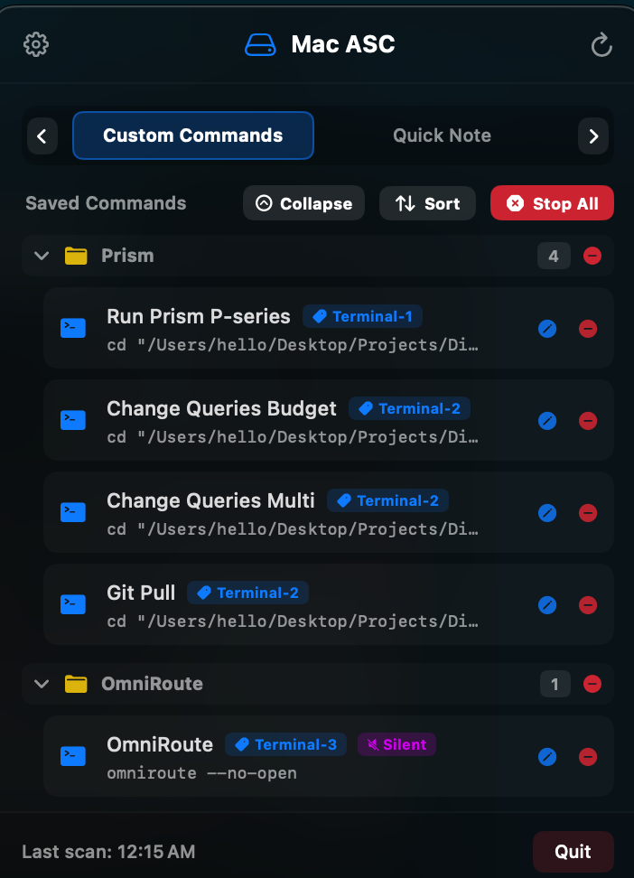
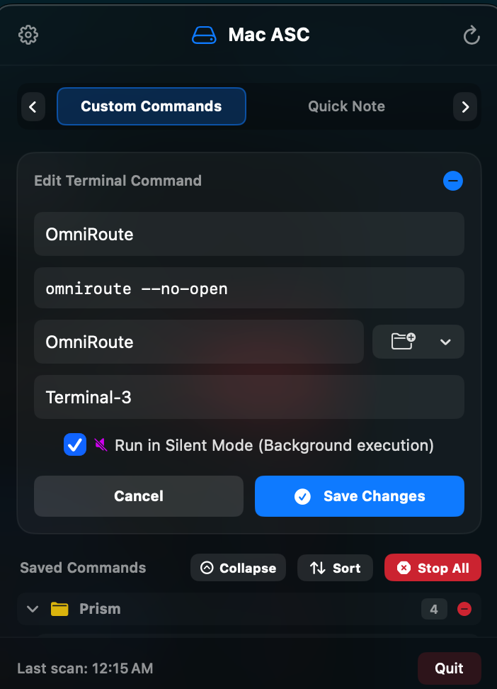

# ⚡ Custom Shell Script Commands & Silent Mode User Manual

Welcome to the **Custom Shell Script Commands** user guide for Mac ASC. This module lets you store, organize, and execute your daily terminal automation scripts directly from your macOS menu bar.

---

## 📸 Visual Overview

  

---

## 🔍 Key Capabilities

1. **Dual Execution Modes**:
   - **Visual Terminal Mode**: Opens and runs the script inside a dedicated macOS Terminal window/tab (`Terminal.app`).
   - **🔇 Silent Background Mode**: Runs the script headlessly in the background via native Swift subprocesses (`Process()`) with **zero Terminal windows popping open**.

2. **Nested Folder Hierarchy**:
   - Organize scripts using slash paths (e.g. `DevOps/Docker` or `Database/Backup`).
   - Subfolders render with visual tree indentation, recursive collapse/expand, and item count badges.

3. **Live Process Monitoring & Cancellation**:
   - Active processes show a live running indicator (`stop.circle.fill`).
   - Click the **Stop Button** on any running command row to terminate background processes (`process.terminate()`) or send `SIGINT` (Ctrl+C) to foreground Terminal tabs.

  

---

## 🛠️ Step-by-Step Usage & Examples

### Example 1: Creating a Silent Background Script (e.g. Docker Clean)
1. Switch to the **Custom Commands** tab (`⌘2`).
2. Click **+ Add Command**.
3. Fill in the form fields:
   - **Name**: `Prune Docker Cache`
   - **Command**: `docker system prune -af --volumes`
   - **Folder**: `DevOps/Docker`
   - **Tag**: `Maintenance`
   - **Check Option**: ☑️ **Run in Silent Mode (Background execution)**
4. Click **Add Command**.
5. Click your new command row to execute it. Notice that **no Terminal window pops open**—it runs headlessly in the background! A purple `[🔇 Silent]` badge and orange running indicator confirm it is executing.

### Example 2: Creating a Foreground Terminal Script with Window Tag
1. Click **+ Add Command**.
2. Fill in:
   - **Name**: `Start Local Dev Server`
   - **Command**: `cd ~/Desktop/Projects/MyApp && npm run dev`
   - **Folder**: `DevOps/Dev`
   - **Tag**: `DevServer`
   - **Option**: Leave *Run in Silent Mode* **unchecked**.
3. Click **Add Command**.
4. When executed, Mac ASC launches macOS `Terminal.app` and runs your script inside a tab tagged `DevServer`. Re-running it will reuse the existing tagged tab!

### Example 3: Stopping a Long-Running Background Task
1. If a silent or terminal script is taking too long (e.g., a long build or download), locate its row in the custom command list.
2. Click the orange **Stop Button** (`stop.circle.fill`) next to the command.
3. Mac ASC immediately sends a termination signal to halt the script cleanly.

---

## 💡 Process Safety & Security
- Background processes execute under your standard macOS user account privileges (`/bin/bash`).
- Safety process guards ensure process termination logic strictly targets child processes spawned by your custom commands, never touching unrelated system processes.
