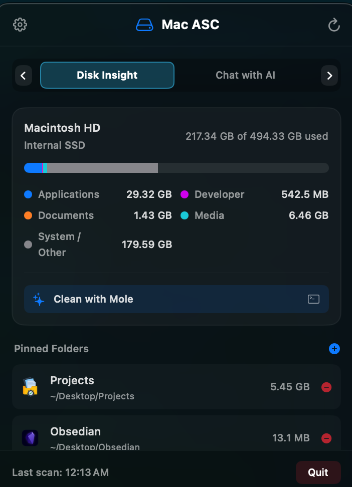
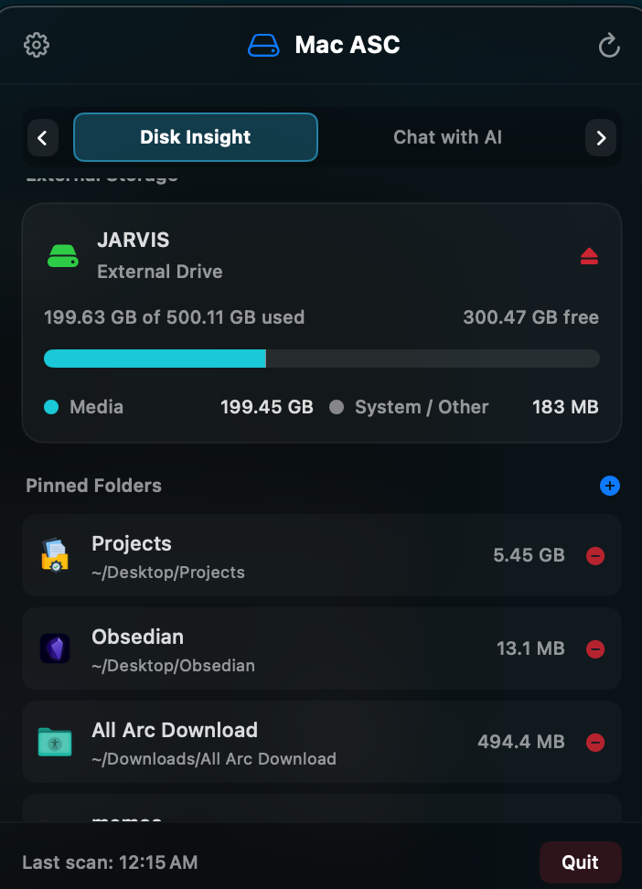

# 📊 Disk Insight & Drive Storage User Manual

Welcome to the **Disk Insight & Drive Storage** user guide for Mac ASC. This module provides a real-time, categorized breakdown of your Mac's internal storage, external volume monitoring, and custom folder size tracking.

---

## 📸 Visual Overview

  

---

## 🔍 Key Capabilities

1. **Categorized Storage Breakdown**:
   - Visualizes disk space distribution into 5 distinct categories:
     - 🔵 **Applications**: Installed macOS software packages.
     - 🟣 **Developer Files**: Xcode caches, Swift build directories (`.build`), package managers, and node modules.
     - 🟠 **Documents**: User documents, text files, and PDFs.
     - 🟢 **Media Files**: Images, audio tracks, and video files.
     - ⚪ **System & Other**: macOS system runtime, OS snapshots, and uncategorized files.

2. **Multi-Drive & External Storage Monitor**:
   - Automatically detects external USB drives, SD cards, and Thunderbolt disks.
   - Displays volume names, used space, free space, and mount paths.
   - Provides a single-click **Eject Volume** (`eject.fill`) button to safely unmount external disks without Finder warnings.

3. **Pinned Folder Size Tracker**:
   - Allows you to pin any folder on your Mac to the dashboard.
   - Measures folder size asynchronously in the background so your UI never freezes.
   - Includes a **Finder Icon Button** (`folder.fill`) to open pinned directories instantly.

  

---

## 🛠️ Step-by-Step Usage & Examples

### Example 1: Locating Large Applications
1. Open the Mac ASC dropdown from your menu bar.
2. Ensure you are on the **Disk Insight** tab (`⌘1`).
3. Scroll down to the **Applications** list.
4. Top installed applications are sorted by size. Click any application row to immediately highlight it in macOS Finder (`/Applications`).

### Example 2: Monitoring & Ejecting External USB Disks
1. Plug an external USB flash drive or hard drive into your Mac.
2. Mac ASC automatically detects the disk under the **External Storage** section.
3. View available capacity and storage usage.
4. When done, click the **Eject** button (`eject.fill`) on the right side of the drive row. Mac ASC safely unmounts the disk cleanly.

### Example 3: Pinning a Project Folder (e.g. `~/Developer/MyProject`)
1. In the **Pinned Folders** section, click the `+` button.
2. Select any folder from the native macOS file picker (e.g., your project directory or downloads folder).
3. The folder will appear on your dashboard with its calculated size updated asynchronously in the background.
4. Click the folder icon anytime to open it directly in Finder.

---

## 💡 Performance & Privacy Guarantee
- Disk scans use native macOS file system APIs (`FileManager`).
- All calculations occur 100% locally on your machine with **zero network requests**.
