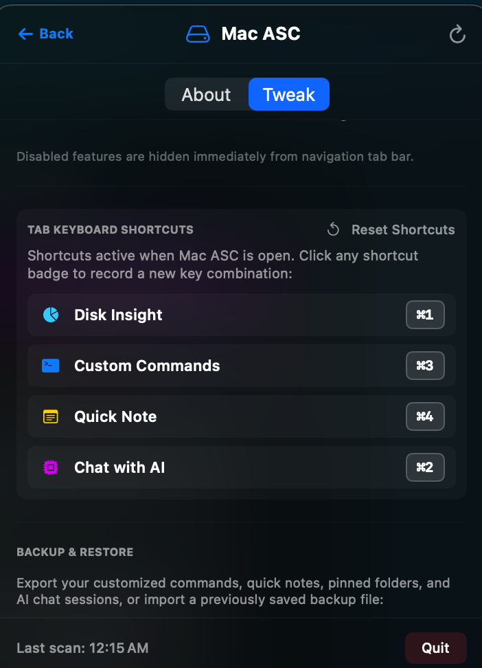
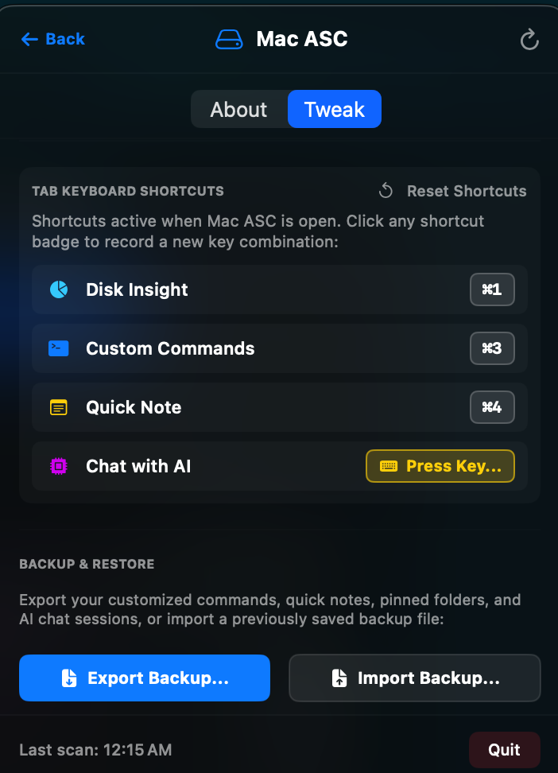

# ⌨️ Tab Keyboard Shortcuts & Swipe Gestures User Manual

Welcome to the **Tab Shortcuts & Gestures** user guide for Mac ASC. This module allows you to navigate instantly between dashboard tabs using customizable key combinations or natural two-finger swipe gestures on your trackpad.

---

## 📸 Visual Overview

  

---

## 🔍 Key Capabilities

1. **Default Tab Shortcuts**:
   - `⌘1`: Switches to **Disk Insight**
   - `⌘2`: Switches to **Custom Commands**
   - `⌘3`: Switches to **Quick Notes**
   - `⌘4`: Switches to **Chat with AI**

2. **🛝 Two-Finger Swipe Gesture Navigation**:
   - Swipe horizontally with two fingers on your trackpad to cycle through navigation tabs.
   - **Circular Loop**: Swiping right at the last tab wraps back to the first tab, and vice versa.
   - **Skip Prevention**: Built-in gesture cooldowns ensure a single swipe advances exactly one tab at a time.

3. **Interactive Key Recorder**:
   - Easily reassign any tab to custom key combinations (e.g. `⌥1..4`, `⌃D`, `Ctrl+N`) in Settings.

4. **Window-Scoped Safety (Zero Telemetry)**:
   - Event monitoring runs **strictly while the Mac ASC window is open**.
   - When the panel is closed, monitoring is destroyed, using **0% CPU** and **0 MB RAM** with zero possibility of key or scroll collisions with other apps.

  

---

## 🛠️ Step-by-Step Usage & Examples

### Example 1: Reassigning a Shortcut in Settings
1. Open Mac ASC -> click the **Settings Gear Icon** (`⚙️`) in the header.
2. Scroll to the **TAB KEYBOARD SHORTCUTS** section.
3. Click the shortcut badge for **Quick Notes** (`[ ⌘3 ]`).
4. The badge will change to **"Press Key..."** (`⌨️`).
5. Press your desired key combination (e.g., press `Option + N` -> `⌥N`).
6. The badge instantly updates to `⌥N` and saves to your preferences!

### Example 2: Swiping to Switch Tabs
1. Open the Mac ASC dropdown from your menu bar.
2. Swipe left with two fingers on your trackpad to advance to the next tab (**Custom Commands**).
3. Swipe left again to go to **Quick Notes**.
4. Swipe right to go back to **Custom Commands**.

### Example 3: Text Editing & Vertical Scroll Safety
1. Focus your cursor inside a Quick Note or Search input -> type text -> single-character hotkeys are automatically ignored so your typing is never interrupted.
2. Scroll vertically inside the Custom Commands or Quick Notes view -> vertical scrolling works completely normally without switching tabs.

---

## 💡 System Protection & Reset
- Click **Reset Shortcuts** in Settings anytime to restore default `⌘1`, `⌘2`, `⌘3`, `⌘4`.
- No global keylogger or accessibility permissions are requested or required.
