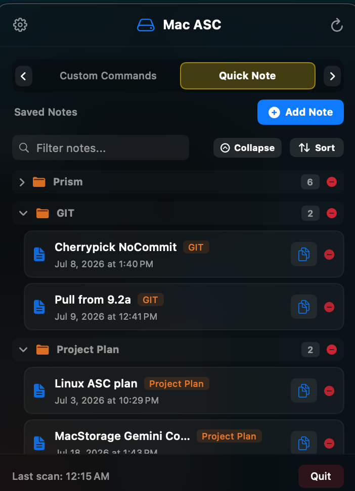
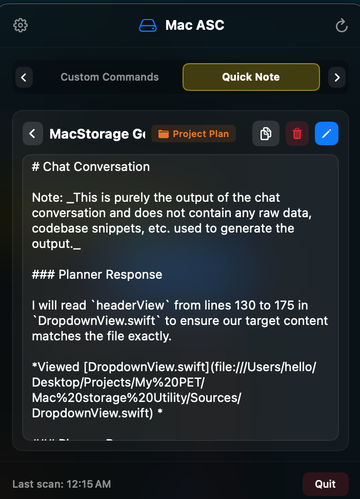

# 📝 Quick Notes & Viewport Virtualization User Manual

Welcome to the **Quick Notes Manager** user guide for Mac ASC. This module offers instant, lightweight note-taking directly from your menu bar with high-performance viewport virtualization for large files.

---

## 📸 Visual Overview

<p align="center">
  
</p>

---

## 🔍 Key Capabilities

1. **Native Viewport Virtualization**:
   - Built using AppKit's `ReadOnlyNoteTextView` layout engine.
   - Renders multi-megabyte text files and large code snippets with **0ms instant load times** and smooth trackpad scrolling.
   - Prevents main-thread UI beachballs when opening extensive documentation or long code logs.

2. **Nested Folder Subtrees**:
   - Organize notes into folder hierarchies (e.g. `Work/Meetings` or `Code/Snippets`).
   - Supports search filtering across note titles, contents, and tags.

3. **Read-Only vs Edit Mode**:
   - Opens notes in clean **Read-Only Mode** to prevent accidental edits while browsing.
   - Click the **Pencil Icon** to switch to Edit Mode anytime.
   - Single-click **Copy Button** to copy full note contents to your clipboard.

<p align="center">
  
</p>

---

## 🛠️ Step-by-Step Usage & Examples

### Example 1: Creating a Quick Note
1. Switch to the **Quick Note** tab (`⌘3`).
2. Click **+ Add Note**.
3. Enter note details:
   - **Title**: `API Credentials & Endpoints`
   - **Folder**: `Dev/Config`
   - **Content**:
     ```json
     {
       "staging_url": "https://staging.api.example.com",
       "version": "v1.2.0"
     }
     ```
4. Click **Add Note**.

### Example 2: Reading & Copying a Note
1. Click any note row in the note list.
2. The note opens in virtualized **Read-Only Mode**.
3. Use the top toolbar buttons:
   - 📋 **Copy**: Copies the entire note text to your macOS clipboard.
   - ✏️ **Edit**: Unlocks text editing mode to make updates.
   - 🗑️ **Delete**: Removes the note with confirmation.
   - ◀️ **Back**: Returns to the note list.

---

## 💡 Storage & Backup
- All notes are saved locally in macOS user defaults (`UserDefaults`).
- Notes can be exported to JSON backup files in Settings for instant cross-device transfer or recovery.
