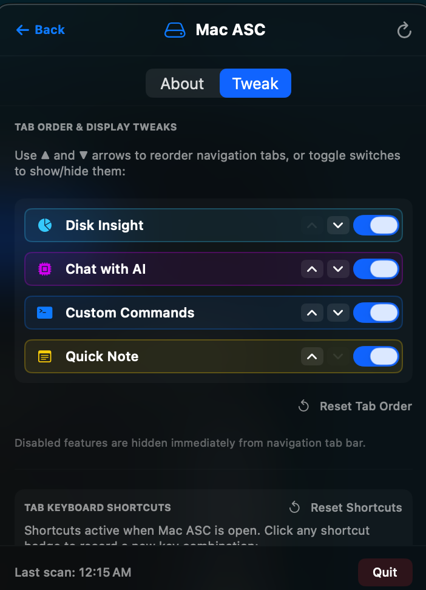
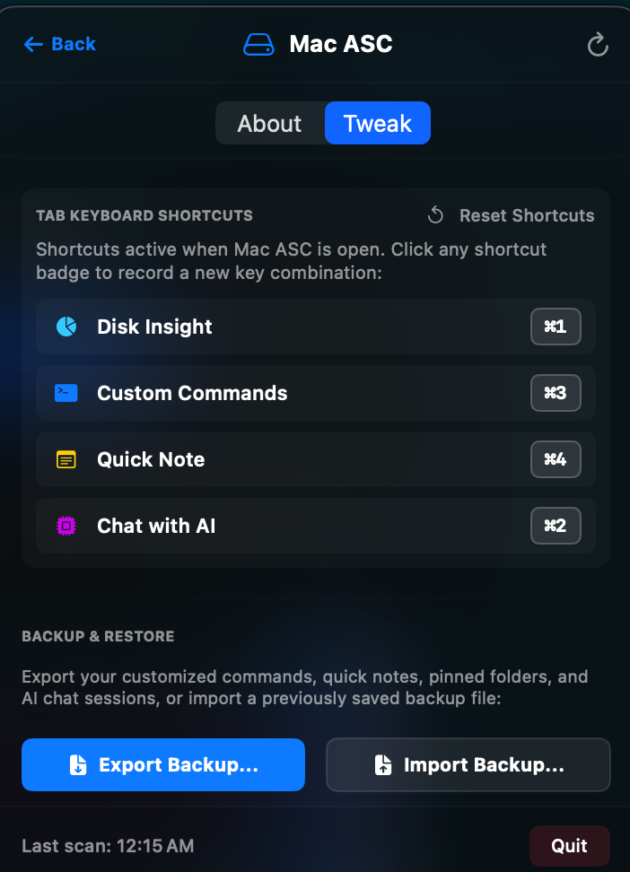

# ⚙️ Dashboard Tweaks, Tab Customization & Settings Backup User Manual

Welcome to the **Settings & Backup System** user guide for Mac ASC. This module allows you to personalize your dashboard layout, reorder navigation tabs, toggle component visibility, and backup/restore your entire application configuration.

---

## 📸 Visual Overview

  

---

## 🔍 Key Capabilities

1. **Dashboard Tweaks & Component Visibility**:
   - Enable or disable dashboard components (*Disk Insight*, *Custom Commands*, *Quick Note*, *Chat with AI*) using simple toggle switches.
   - Hidden components are immediately removed from the top navigation bar to declutter your interface.

2. **Manual Tab Reordering**:
   - Reorder dashboard tabs using **Up (`▲`) and Down (`▼`) arrow controls**.
   - Custom tab display order is saved automatically to user preferences.

3. **Complete JSON Backup & Restore**:
   - Export all custom commands, quick notes, subfolder trees, tab sorting order, folder sort orders, pinned directories, tweak switches, shortcut mappings, and AI chat threads to a single `.json` backup file.
   - Upload/import backup files to restore your entire workspace setup on a new Mac in seconds.

  

---

## 🛠️ Step-by-Step Usage & Examples

### Example 1: Hiding a Tab & Reordering Navigation
1. Click the **Settings Gear Icon** (`⚙️`) in the header.
2. Under **DASHBOARD TWEAKS & TAB CONFIGURATION**:
   - Toggle off any component you don't need (e.g. toggle off *Quick Note*).
   - Use the **Up/Down arrow buttons** next to a tab row to move *Chat with AI* to the top position.
3. Close Settings. Notice your navigation tab bar now displays your custom ordered tabs!

### Example 2: Exporting a Settings Backup
1. Open Settings -> scroll down to **BACKUP & RESTORE**.
2. Click **Export Backup...**.
3. Choose a destination folder on your Mac (e.g., `~/Documents/macasc_backup.json`).
4. Click **Save**. All commands, notes, folder structures, shortcuts, and AI threads are encoded into a clean JSON file.

### Example 3: Restoring Backup on a New Mac
1. Install Mac ASC on your new Mac.
2. Open Settings -> scroll down to **BACKUP & RESTORE**.
3. Click **Import Backup...**.
4. Select your `macasc_backup.json` file.
5. Mac ASC instantly restores all your custom commands, notes, folder structures, settings, and AI chat history!

---

## 💡 Privacy Guarantee
- Backup JSON files are generated 100% locally on your machine.
- No cloud upload endpoints or remote database servers are used.
